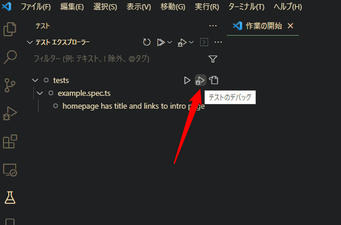
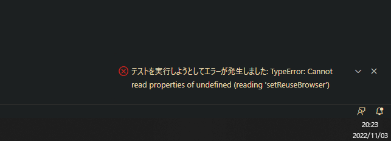
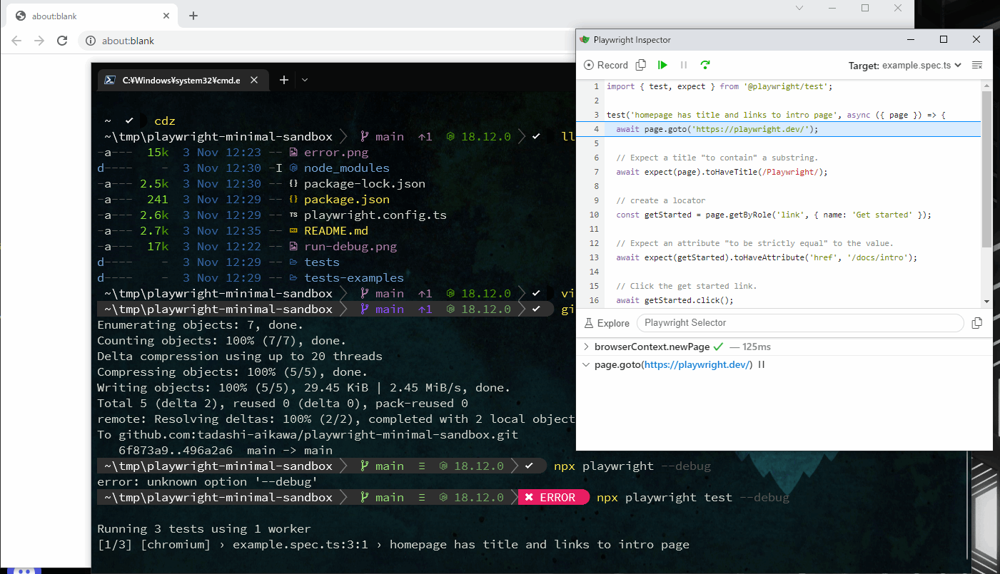

# What is this?

I created this repository to resolving the following issue.

[Both "Show browser" or "Run in Debug Mode" are not working · Issue \#18424 · microsoft/playwright](https://github.com/microsoft/playwright/issues/18424)

## Reproduction steps for the [issue](https://github.com/microsoft/playwright/issues/18424)

### Clone and install dependencies

```console
git clone https://github.com/tadashi-aikawa/playwright-minimal-sandbox.git
cd playwright-minimal-sandbox
npm i
```

### Open by VSCode

```console
code .
```

### Run as debug.



### It shows an error toast.



## CLI works fine

```console
npx playwright test --debug
```



## How did this repository create?

```console
$ npm init playwright@latest

Need to install the following packages:
  create-playwright@1.17.123
Ok to proceed? (y) y
Getting started with writing end-to-end tests with Playwright:
Initializing project in '.'
√ Do you want to use TypeScript or JavaScript? · TypeScript
√ Where to put your end-to-end tests? · tests
√ Add a GitHub Actions workflow? (y/N) · false
√ Install Playwright browsers (can be done manually via 'npx playwright install')? (Y/n) · true
Initializing NPM project (npm init -y)…
Wrote to C:\Users\syoum\tmp\playwright-minimal-sandbox\package.json:

{
  "name": "playwright-minimal-sandbox",
  "version": "1.0.0",
  "description": "",
  "main": "index.js",
  "scripts": {
    "test": "echo \"Error: no test specified\" && exit 1"
  },
  "keywords": [],
  "author": "",
  "license": "ISC"
}


Installing Playwright Test (npm install --save-dev @playwright/test)…

added 3 packages, and audited 4 packages in 4s

found 0 vulnerabilities
Downloading browsers (npx playwright install)…
Writing playwright.config.ts.
Writing tests\example.spec.ts.
Writing tests-examples\demo-todo-app.spec.ts.
Writing package.json.
✔ Success! Created a Playwright Test project at C:\Users\syoum\tmp\playwright-minimal-sandbox

Inside that directory, you can run several commands:

  npx playwright test
    Runs the end-to-end tests.

  npx playwright test --project=chromium
    Runs the tests only on Desktop Chrome.

  npx playwright test example
    Runs the tests in a specific file.

  npx playwright test --debug
    Runs the tests in debug mode.

  npx playwright codegen
    Auto generate tests with Codegen.

We suggest that you begin by typing:

    npx playwright test

And check out the following files:
  - .\tests\example.spec.ts - Example end-to-end test
  - .\tests-examples\demo-todo-app.spec.ts - Demo Todo App end-to-end tests
  - .\playwright.config.ts - Playwright Test configuration

Visit https://playwright.dev/docs/intro for more information. ✨

Happy hacking! 🎭
```
